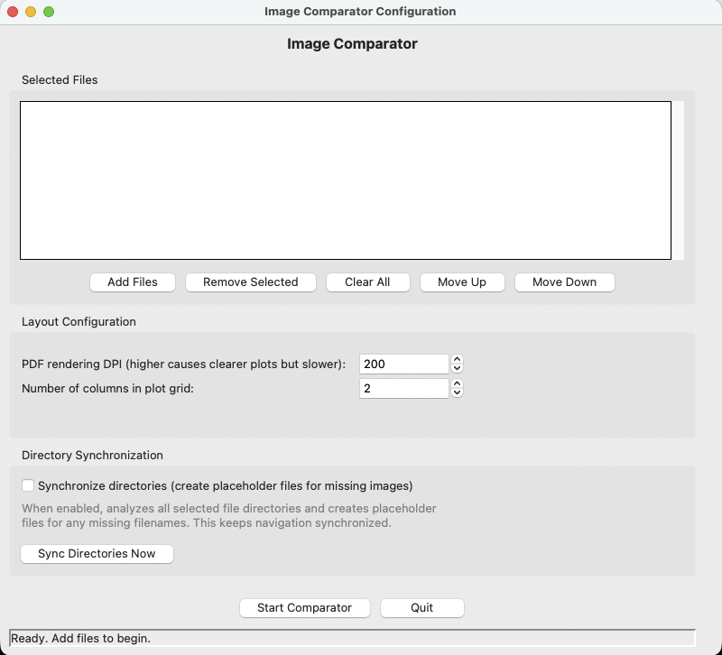

# image-comparator
Compare sets of images side by side with keyboard navigation.

## About
`image-comparator` is a desktop application for viewing multiple sets of plot or image files side by side and navigating through them **synchronously** with the keyboard.

It is useful when you have several versions or types of plots for the same datapoint. For example, different types of plots for the same biological sample, maybe showing some qc results and downstream analysis results for the same sample.

Load one or more directories of images, then use the arrow keys to move through the files. Each panel advances to the corresponding next image at the same time, making visual comparison fast and convenient.

## How it works

You select the starting plot files, and the application infers all the plots in their respective directories, sorts them in ascending order, and accordingly obtains the index of each of the plots you chose in their respective directories. Then, in the visualizer mode, as you scroll up and down using arrow keys, all the plots switch to the next (down arrow) or previous (up arrow) plot simultaneously.

For reliable synchronized navigation, images should be named consistently across directories as the application sorts files alphabetically before displaying them. One reasonable approach is to have all the plot files named according to the identifier for a datapoint, and the parent directory indicating what type of plots are held in it.

For example, if you have two directories:

```text
expression_plots/
├── sample_A.png
├── sample_B.png
└── sample_C.png

segmentation_plots/
├── sample_A.png
├── sample_B.png
└── sample_C.png
```

In this case, navigating forward will show something like this:

| Position | Expression panel | Segmentation panel |
|---|---|---|
| 1 | `sample_A.png` | `sample_A.png` |
| 2 | `sample_B.png` | `sample_B.png` |
| 3 | `sample_C.png` | `sample_C.png` |

### Syncing directories

Sometimes you may not have plots corresponding to all the samples in each directory you want to navigate through. In this case, as you scroll through the directories in the visualizer mode, the plots may get out of sync. If you adopt the strategy of naming all the plot files with just the identifier of the datapoint, then we can simply have placeholder files for the missing datapoints in each directory, so that upon scrolling, we dont get out of sync. To do this, after you have selected the initial plots, simply press "Sync Direcories Now" button. This will create placeholder files in the directories of the selected plots for whichever datapoints were missing compared to the union of all the datapoints in the chosen plots' directories.

## Installation

- Ensure that pipx is installed. Depending on your platform, run one of the following in terminal:
	- macOS
		```sh
		brew install pipx
		```
	- Windows
		```
		py -m pip install --user pipx
		```
	- Ubuntu/Debian
		```
		sudo apt install pipx
		```

- Install image-comparator using pipx:
	- The supported python versions to build the tool are 3.10, 3.11, 3.12, 3.13. If you already have any of them available in your env, specify them as such:
		```sh
		pipx install image-comparator --python 3.12 # change version according to what is available in your env 
		```
	- Else, just use this command, which will install a standalone python installation automatically, hence may take a few minutes to complete
		```sh
		pipx install image-comparator --python 3.12 --fetch-python=missing
		```
- To ensure that the .local/bin path is in your PATH env variable, run:
	```sh
	pipx ensurepath
	```
- Restart your terminal for the changes to take effect.
- Now you can simply use the tool by running:
	```sh
	image-comparator
	```

## Getting started

When the application opens, configure the files and layout before starting the comparator:



### 1. Add files or directories

Click **Add Files** and select the plot files or collections you want to compare.

Use the list controls to organize your selection:

- **Add Files** — add plot files or image collections
- **Remove Selected** — remove the currently selected entry
- **Clear All** — remove every selected entry
- **Move Up** / **Move Down** — reorder selected entries in the comparison layout

The order of selected entries determines the order in which plot collections appear in the comparator.

### 2. Set the rendering DPI (irrelevant if not working with .pdf plots)

Use **PDF rendering DPI** to control the resolution used when rendering PDF plots.

- Higher DPI produces sharper plots, especially for text and fine lines.
- Higher DPI also uses more memory and may make navigation slower.
- The default value of `200` is usually a good starting point.

Increase the DPI if PDF plots appear blurry; decrease it if opening or navigating large plot collections is slow.

### 3. Choose the grid layout

Set **Number of columns in plot grid** to control the number of plot panels shown in each row.

The application automatically arranges the selected collections in a row-major order into the grid.

### 4. Start comparing

Click **Start Comparator**.

The image-viewing window will open with the first files from each selected collection displayed together.

Use the keyboard arrow keys to navigate:

- **Down Arrow** — move forward to the next set of plots
- **Up Arrow** — move backward to the previous set of plots

All displayed plot collections move together, allowing you to compare corresponding samples or images efficiently.

## Uninstalling

- If want to uninstall, simply run:
	```
	pipx uninstall image-comparator
	```

